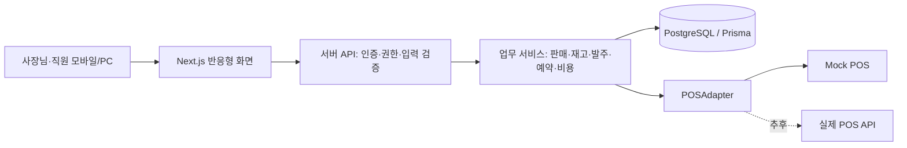
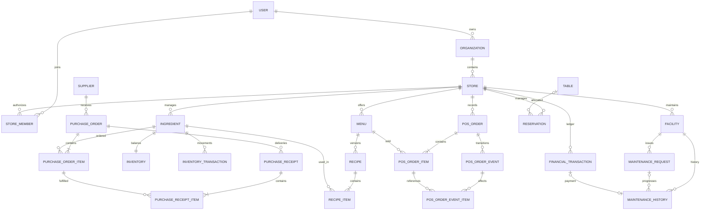

# 음식점 통합 운영 관리 서비스 — Phase 0 설계안

작성 기준: 2026-10-07. 사용자가 제공한 기획서와 일곱 가지 추가 답변을 반영했다.
이 문서는 설계 결과물이다. 애플리케이션, DB, 로그인, 외부 연동을 아직 구현하지 않았다. 구현은 사용자 승인 후 시작한다.

## 1. 서비스 요구사항 분석

### 목표와 초기 운영 방식

지인이 운영하는 한 음식점에 무료로 제공하는 반응형 웹 서비스로 시작한다. 사장님은 매출·비용·재고·예약·시설 상태를 한곳에서 보고, 직원은 영업 중 필요한 업무를 적은 입력으로 처리한다. 향후 여러 음식점에 제공할 수 있도록 데이터 분리와 권한 검사는 처음부터 적용한다.

추가 확정: 첫 매장은 햄버거 가게이며 메뉴는 **햄버거 1개 종류**만 운영한다. 사장님 외 직원은 **1명**, 수동 판매는 **영업 종료 후 하루 합산 입력**이다. 초기 계정은 Owner 1명과 Staff 1명을 기본으로 하고 Manager 역할은 확장 가능한 구조로만 유지한다.

| 항목 | 확정된 방향 |
| --- | --- |
| 제공 대상 | 초대받은 지인과 매장 직원. 초기 공개 회원가입 없음 |
| 매장 규모 | 첫 화면과 운영은 한 매장 기준. DB에는 Organization·Store 유지 |
| 초기 메뉴 | 햄버거 1종. 세트·음료·옵션 메뉴는 초기 범위에서 제외 |
| 초기 사용자 | Owner 1명 + Staff 1명. 별도 Manager 계정은 만들지 않음 |
| 요금 | 초기 무료. 구독 결제 기능은 구현하지 않음 |
| 플랫폼 | 모바일·PC 반응형 웹. 네이티브 앱은 이후 |
| POS | 특정 업체 미선정. Mock POS와 수동 판매 입력으로 시작 |
| 예약 | 전화·네이버·캐치테이블 등에서 받은 예약을 직원이 수동 통합 관리 |
| 재고 | 레시피 기반 자동 차감, 변동 이력, 품목별 최소보유량 설정 |
| 발주 | 규칙 기반 추천과 사람이 확인하는 발주. 자동 주문 전송 없음 |
| 매출·입출금 | 햄버거 하루 합산 수량·가격·할인·환불과 수동 비용으로 계산 |
| 시설 | 장비·고장·수리 이력과 수리비 입력. 외부 업체 요청은 이후 |
| 계산 방식 | 일반 코드·DB·API·규칙 사용. 서비스 실행 중 LLM API 사용 없음 |

### 역할과 권한 기본값

| 작업 | Owner | Manager | Staff |
| --- | --- | --- | --- |
| 운영 대시보드·예약 확인 | 가능 | 가능 | 제한된 운영 정보만 |
| 매출·비용·추정 손익 조회/입력 | 가능 | 기본 차단 | 차단 |
| 메뉴·레시피·재고 기준 설정 | 가능 | 가능 | 차단 |
| 재고 입고·실사·폐기 | 가능 | 가능 | 허용된 사용·폐기 입력만 |
| 발주 확정·입고 처리 | 가능 | 가능 | 차단 |
| 예약 등록·변경·취소·노쇼 처리 | 가능 | 가능 | 초기에는 확인·착석 처리만 |
| 시설 이상 등록 | 가능 | 가능 | 가능 |
| 수리 완료·수리비 입력 | 가능 | 비용 제외한 작업 상태 관리 | 차단 |
| 직원 초대·역할 변경·매장 설정 | 가능 | 차단 | 차단 |

권한은 화면 숨김과 별도로 서버에서 검사한다. 비용 조회가 불가능한 사용자의 시설 API 응답에서도 수리비를 제외한다. Manager가 실제로 비용을 관리해야 한다면 추후 Owner가 부여하는 별도 권한으로 확장한다.

### 범위와 성공 기준

- 사장님이 판매·재고 부족·예약·비용을 실제 입력하고 확인할 수 있어야 한다.
- 같은 판매를 두 번 가져와도 매출과 재고가 중복 반영되지 않아야 한다.
- 다른 매장 식별자를 보내도 다른 매장의 데이터가 조회되거나 변경되지 않아야 한다.
- 정상적인 개발·운영에 외부 AI API가 필요하지 않아야 한다.
- 실매장 사용 전 필수: 인증·권한, DB 마이그레이션, 핵심 계산 테스트, 업무 흐름 E2E, 백업·복구 검증.
- 선택 검증: 실제 POS·은행·예약 플랫폼 연동. MVP 필수 검증에는 포함하지 않는다.

## 2. MVP 기능 정의

### Must Have — 실제 첫 매장에 필요한 기능

1. 초대 기반 로그인, Owner·Manager·Staff, 매장별 데이터 분리.
2. 메뉴·재료·레시피 등록, 재료 단위와 단가 관리.
3. 입고·사용·폐기·실사 조정 및 재고 변동 이력.
4. 햄버거 하루 합산 판매 등록과 Mock POS, 합산 확정 시 레시피 자동 차감.
5. 할인·취소·부분 환불 처리, 명시적 재입고, 중복 처리 방지.
6. 최소보유량·목표재고·발주 묶음 단위 설정 및 발주 추천.
7. 공급업체, 발주 초안·확정·부분 입고·입고 완료 관리.
8. 외부에서 받은 예약 수동 등록, 경로·인원·상태·테이블 관리.
9. 시설 등록, 이상·수리 이력, 수리비를 비용 장부에 한 번만 반영.
10. 판매 기반 매출, 수동 수입·비용 장부, 운영용 추정 잔액·손익 카드.
11. 오늘 매출·예약·부족 재고·발주·시설 점검 대시보드.
12. 모바일 화면, 기본 입력 검증, 백업 및 개인정보 접근 제한.

### Should Have — 첫 사용 결과에 따라 추가

- 공급업체별 발주서 출력/CSV, 메뉴·재료 CSV 가져오기.
- 고정비 반복 입력, 재고 이력 CSV 내보내기.
- 매장 전환 UI, 테이블 미배정 예약 알림.
- 필수 감사 기록을 확장한 변경 내역 조회 화면.
- PWA 설치, 간단한 점검/발주 알림.
- 재료의 입고 로트·유통기한별 재고 관리. 집계 재고만으로 정확한 유통기한 추적이 된다고 표시하지 않는다.

### Later — 범위를 별도 확정

- 접근 권한과 계약이 확인된 POS 업체 API·웹훅 연결.
- 외부 예약 API, 카드매출·통장·세금계산서 연동.
- 수리업체 등록·견적·요청 전달·중개 수익.
- 발주 자동 전송, 리드타임·요일 판매량·MOQ를 이용한 고급 추천.
- 공개 회원가입, 조직 단위 다중 소유자, 세부 권한 설정, SaaS 과금.
- 네이티브 앱, 오프라인 판매 처리, 전문 회계·세무 기능.

무료 서비스의 수입원은 수리업체 소개 수수료나 공급업체 제휴 등을 나중에 검증한다. 사용자 동의 없는 예약 고객정보 판매는 수입원으로 설계하지 않는다.

## 3. 전체 시스템 Architecture



하나의 Next.js 애플리케이션에 화면과 서버 API를 두는 Modular Monolith를 사용한다. 처음부터 별도 마이크로서비스, 메시지 브로커, Redis를 도입하지 않는다. 업무 계산은 화면과 분리된 TypeScript 함수/서비스로 작성한다.

### 기술 선택과 현재 확인 수준

2026-10-07에 npm 레지스트리에서 아래 버전 및 engines/peerDependencies를 조회했다. 이는 패키지의 호환성 선언 확인이며 빌드·실행 검증은 아니다.

| 도구 | 제안 | 선택 이유/확인 |
| --- | --- | --- |
| Node.js | 24.x, 구현 시작 시 패치 버전 고정 | 현재 머신 24.19.0. Next·Prisma·Vitest 요구 범위 충족 |
| Next.js | 16.4.0 | Node >=20.9, React 19 지원 선언 |
| React / React DOM | 19.3.0, 같은 버전 | 서버·화면 패키지 버전 일치 |
| TypeScript | 5.9.3 | 검증 범위가 넓은 안정 계열. 새 major 7 도입은 미룸 |
| Tailwind CSS | 4.3.3 | 반응형 레이아웃과 큰 버튼 구현 |
| PostgreSQL | 17 계열 | 정확한 Decimal·트랜잭션·동시성 제어. 런타임 검증은 Phase 1 |
| Prisma CLI / Client / adapter-pg | 모두 7.10.0 | CLI latest가 8.0.0 RC여서 제외. 세 패키지 버전 통일 |
| 인증 | Auth.js의 NextAuth 4.24.15 안정 버전 | 메타데이터상 Next 16·React 19 허용. v5 beta는 초기 도입 제외 |
| 입력 검증 | Zod 4.6.5 | 서버에서 입력·열거형·금액 문자열 검증 |
| 단위·통합 테스트 | Vitest 5.0.3 | Node 24 지원. 핵심 업무 계산 테스트 |
| 브라우저 테스트 | Playwright 1.63.0 | Node >=20. 실제 로그인·판매·재고 흐름 검증 |

Phase 1에서는 해당 조합을 실제 설치·타입 검사·빌드·로그인 테스트하고, 문제가 있으면 안정 버전 범위에서 조정한다. Prisma 7의 PostgreSQL 드라이버 어댑터와 설정 방식을 적용한다. npm lockfile을 생성한 뒤 이후 설치는 `npm ci`로 재현한다.

초기 인증은 공개 가입 없이 초대된 이메일·비밀번호 방식으로 제안한다. 비밀번호는 Argon2id로 해시하고 초대 토큰은 해시·만료·일회성 사용을 적용한다. JWT 기반 세션을 사용하더라도 모든 요청에서 현재 StoreMember와 계정 활성 상태를 확인해 권한 변경·퇴사 후 접근을 막는다. 로그인 실패 제한, 안전한 쿠키와 CSRF 방어도 실사용 전 구현한다. 개발·운영 인증 키는 안전한 환경 설정으로 주입하며 문서나 저장소에 값을 넣지 않는다.

### POS 경계

`POSAdapter`는 `fetchOrders`, `fetchOrderDetail`, `fetchSales`, `fetchPayments`를 제공한다. 초기 Mock은 고정 seed·고정 주문 식별자로 동일한 자료를 재현한다. 운영 매장에는 Mock 자료를 섞지 않고 별도 데모 매장에만 넣는다.

실제 Adapter는 업체별 메뉴 코드·가격·할인·환불·결제 상태를 서비스의 공통 형식으로 바꾼다. 메뉴 코드 미매핑이나 정보가 부족한 주문은 보류 상태로 남기고 직원이 확인한다. 판매와 결제를 각각 받아도 매출을 이중으로 만들지 않는다. 핵심 집계는 정규화된 판매/결제 사건 하나를 기준으로 한다.

장래 예약·은행·수리업체 연동도 별도 경계로 추가한다. 지금은 외부 서비스 계약·API 키가 필요하지 않다.

## 4. Database Entity 설계

### 공통 규칙

- 기본 키는 UUID. 업무 Entity에는 `storeId`, `createdAt`, `updatedAt`를 둔다.
- Organization·Store·User는 각자 범위에 맞는 키를 갖고, StoreMember가 User와 Store를 연결한다.
- 원화 금액은 정수 원 단위 `BIGINT`. API에서는 문자열로 전달하고 서버에서는 BigInt/정확한 Decimal을 사용한다. 금액에 부동소수점 Number 연산을 사용하지 않는다.
- 재료 수량은 `NUMERIC(18,3)`, 단가는 필요시 `NUMERIC(18,6)`. 기본 단위를 g·ml·개로 정규화하며 Decimal로 계산한다. 입력도 문자열로 받는다.
- 단가×수량의 원 미만 처리는 항목별 반올림으로 통일한다. POS가 확정 결제금액을 제공하면 그 금액을 매출 기준으로 유지하고 차이는 조정 항목으로 기록한다.
- 날짜/시간은 UTC `timestamptz`, 매장 영업일·월별 표시 기준은 `Asia/Seoul`. 초기 영업일 경계는 자정이며 야간 영업일 설정은 별도 결정한다.
- 거래 이력은 직접 덮어쓰거나 삭제하지 않고 취소·역분개·조정 사건으로 수정한다. 마스터 데이터는 비활성 처리한다.
- 같은 매장 내 관계는 가능하면 `(storeId, id)` 복합 참조로 다른 매장 연결을 DB에서도 차단한다.

| Entity | 주요 필드 | 관계·제약 |
| --- | --- | --- |
| User | email, passwordHash, name, active | 이메일 unique. 로그인 계정 역할; 별도 Account Entity는 당장 불필요 |
| Organization | name, ownerUserId | 초기 소유자 1명. Store 여러 개 |
| Store | organizationId, name, timezone, active | Organization 소속 |
| StoreMember | storeId, userId, role, active | `(storeId,userId)` unique. 직원별 접근 범위 |
| Menu | storeId, name, category, priceWon, active | Recipe와 POSOrderItem이 참조 |
| Ingredient | storeId, name, category, baseUnit, minimumQty, targetQty, packQty, supplierId, referenceUnitCost | `minimumQty >= 0`, `targetQty > minimumQty`, `packQty > 0` |
| Recipe | storeId, menuId, version, effectiveFrom, active | `(storeId,menuId,version)` unique. 수정은 새 버전 |
| RecipeItem | storeId, recipeId, ingredientId, quantityPerMenu | Recipe의 재료 목록. 기본 단위 수량 > 0 |
| Inventory | storeId, ingredientId, currentQty, lastReceivedAt | `(storeId,ingredientId)` unique. 현재 잔고 캐시 |
| InventoryTransaction | storeId, ingredientId, quantityDelta, type, occurredAt, sourceType, sourceId, idempotencyKey, actorId, reason | append-only. 키 unique. 재고 변화의 원장 |
| Supplier | storeId, name, contact, memo, active | 재료 기본 공급업체와 발주 연결 |
| PurchaseOrder | storeId, supplierId, status, orderedAt, note, createdBy | 발주 여러 품목. 확정과 입고는 별개 |
| PurchaseOrderItem | storeId, purchaseOrderId, ingredientId, orderedQty, receivedQty, unitPriceSnapshot | 가격·단위 스냅샷. 누적입고는 발주량 이하 |
| PurchaseReceipt | storeId, purchaseOrderId, receivedAt, idempotencyKey, actorId | 입고 사건. 중복 요청 방지 |
| PurchaseReceiptItem | storeId, receiptId, purchaseOrderItemId, receivedQty | 부분 입고 이력과 InventoryTransaction 연결 |
| POSConnection | storeId, provider, mode, active | 수동/Mock/실제 연동 경계. 원시 인증정보를 일반 DB 필드로 노출하지 않음 |
| POSMenuMapping | storeId, connectionId, externalMenuId, menuId | 외부 메뉴와 내부 메뉴 매핑 unique |
| POSOrder | storeId, connectionId, externalOrderId, source, businessDate, soldAt, recordedAt, revision, status, currency, grossWon, discountWon, paidWon | `(storeId,connectionId,externalOrderId)` unique. 수동 일합산은 `manual:{businessDate}:{menuId}` 고정 키. soldAt은 정확한 주문시각을 모르면 null |
| POSOrderItem | storeId, orderId, menuId, quantity, unitPriceWon, discountWon, recipeVersionId, recipeSnapshot | 판매 당시 이름·가격·레시피와 실제 차감량 고정 |
| POSOrderEvent | storeId, orderId, externalEventId, kind, businessDate, occurredAt, recordedAt, refundWon, payloadHash, processedAt | 결제완료·합산확정·정정·취소·환불 사건. 일합산 occurredAt은 정확한 시각을 모르면 null. 주문별 이벤트 unique |
| POSOrderEventItem | storeId, eventId, orderItemId, affectedQty, restockDecision | 부분 취소·환불 대상과 실제 재입고 선택 |
| Reservation | storeId, customerName, phone, startAt, endAt, partySize, tableId, source, status, note, createdBy | MVP는 예약당 테이블 하나. 미배정 허용 |
| Table | storeId, label, capacity, active | 매장 내 label unique. 예약을 위한 자원 |
| Facility | storeId, name, category, installedAt, lastInspectionAt, nextInspectionAt, status, memo | 시설 현황. 완료는 작업 상태이며 시설은 Normal로 복귀 |
| MaintenanceRequest | storeId, facilityId, title, description, status, reportedBy, assignedTo, reportedAt | 이상·수리 작업 접수. 직원도 등록 가능 |
| MaintenanceHistory | storeId, facilityId, requestId, eventType, performedAt, memo, financialTransactionId | 점검·수리·완료 기록. 수리비 지출 연결 |
| FinancialTransaction | storeId, occurredAt, type, category, amountWon, paymentMethod, counterparty, description, sourceType, sourceId, actorId, reversesId | 금액 양수와 Income/Expense 방향. 취소는 역방향 사건 |
| AuditLog | storeId, actorId, action, entityType, entityId, occurredAt, changeSummary | 중요 변경의 최소 로그. 비밀번호·토큰·전체 연락처 기록 금지 |
| StoreInvitation | storeId, email, role, tokenHash, expiresAt, acceptedAt, invitedBy | 초대용 단기 데이터. 일회성 사용 |

원문 Entity에 RecipeItem·입고 사건·판매 사건·매핑을 추가했다. 재료 여러 개, 반복 입고, 부분 환불, 연동 중복을 추적하는 데 필요하다. StoreInvitation·AuditLog는 초기 권한 관리와 필수 감사 기록을 위한 보조 Entity다.

### 재고·발주 계산

1. `현재재고 = 해당 재료 InventoryTransaction.quantityDelta 합계`. Inventory.currentQty는 빠른 조회용으로 같은 DB 트랜잭션에서 갱신한다.
2. `판매 차감량 = 메뉴 판매수량 × 판매 당시 레시피의 재료수량`. 초기에는 햄버거 하루 합산 수량을 확정할 때 한 번에 차감한다.
3. `발주 필요 = 현재재고 <= 최소보유량`.
4. `추천 발주량 = ceil(max(0, 목표재고 - 현재재고 - 미입고 발주량) / 발주묶음수량) × 발주묶음수량`.
5. 미입고 발주량은 Ordered·Partially Received의 잔여분. Draft·Cancelled는 제외한다.

예: 소주 현재 18병, 최소 20병, 목표 60병, 묶음 20병이면 60병 추천이다. 이미 40병이 발주되어 미입고이면 추가 추천은 20병이다. 목표를 넘는 결과가 나올 수 있으므로 묶음 올림 이유를 표시한다.

MVP는 최소보유량을 발주 기준으로 사용한다. 혼동을 줄이기 위해 별도 안전재고 설정은 넣지 않는다. 향후 안전재고와 리드타임을 분리할 때 추가한다.

입고와 비용 지급은 별개다. 물건 입고는 재고를 늘리지만 비용을 자동 생성하지 않는다. 실제 지급액을 입력하거나 발주서에서 '비용 기록'을 한 번 실행할 때 장부에 반영한다.

## 5. Entity Relationship과 핵심 처리 흐름



이 그림은 중심 관계를 보여준다. 개별 FK와 보조 Entity는 위 표를 따른다. 모든 Store 자식 간 연결에는 동일 매장 제약을 적용한다.

### 판매 수신 → 매출·재고 반영

인증/연동 확인 → 외부 메뉴 매핑 → 사건 키로 중복 검사 → 판매 당시 레시피 선택 및 스냅샷 → 필요한 재료 잔고 잠금 → 판매 사건·재고 원장·잔고 갱신 → 한 번에 commit.

- 주문 자체와 판매 사건의 중복키를 각각 관리한다. 외부 이벤트 ID가 없으면 안정적인 주문 revision과 사건 유형으로 키를 만들고 변경 내용의 hash도 확인한다.
- 기존 사건과 내용이 다른데 같은 키가 들어오면 덮어쓰지 않고 검토 대상으로 남긴다.
- 재고 잔고 행을 일관된 순서로 잠그고, 직렬화 충돌은 제한된 횟수만 재시도한다.
- 판매가 이미 발생한 경우 재고가 부족하다는 이유로 매출 기록을 버리지 않는다. 음수 재고를 허용하되 실사 필요로 표시한다.
- 판매 당시 적용 레시피를 결정할 수 없는 과거 주문은 자동 차감하지 않고 보류한다. 현재 레시피로 과거 소비량을 추정 반영하지 않는다.

### 취소·환불 → 금액과 물품을 따로 처리

- 판매 확정 전 취소: 매출·재고에 영향 없음.
- 확정 판매 환불: 환불금액을 음의 매출 사건으로 기록. 중복 환불과 누적 초과 환불 방지.
- 조리된 음식: 기본값은 재고 복원 없음. 반품 여부와 상관없이 이미 사용한 식재료는 돌아오지 않음.
- 미개봉 음료 등 실제 재판매 가능 물품: 권한 있는 사용자가 선택한 품목·수량만 원래 차감량 범위에서 복원.
- 조리 전 취소처럼 식재료를 쓰지 않은 경우도 직원 확인 후 복원한다. 모호한 POS 취소를 자동 복원으로 해석하지 않는다.

### 실사

실사 수량을 입력하면 서버가 잠근 현재 잔고와 비교해 `실사수량 - 현재잔고`만큼 조정 원장을 기록한다. 제출 중 잔고가 달라졌다면 새 잔고를 보여주고 재확인한다. 숫자만 직접 덮어쓰지 않는다.

### 햄버거 하루 합산 판매 입력

- 사장님이 영업일, 햄버거 판매수량, 적용 판매단가, 하루 할인합계, 당일 환불금액을 입력하고 계산 결과를 확인해 확정한다. 직원은 초기 권한 기준으로 판매금액을 입력하거나 조회하지 않는다.
- 판매수량은 실제 조리·판매한 햄버거 수량이다. 조리 후 환불된 햄버거도 재료를 사용했으므로 포함한다. 조리 전에 취소된 건은 제외한다. 별도 폐기 입력과 같은 햄버거를 이중 차감하지 않도록 안내한다.
- 영업일·매장·메뉴별 합산 기록은 하나만 허용한다. 저장 버튼 재클릭이나 같은 요청 재전송은 매출·재고에 추가 영향을 주지 않는다.
- 확정 후 오입력 정정은 기존 기록을 지우지 않고 revision과 정정 사건을 남긴다. 20개를 25개로 고치면 추가 5개분만 차감하고 금액도 차이만 반영한다. 원래 레시피 스냅샷을 사용하며 충돌하는 동시 정정은 차단한다.
- 수량을 줄이는 오입력 정정은 과도하게 차감한 재료를 되돌린다. 실제 환불은 별도 환불 사건이므로 수량 정정으로 처리하지 않는다.
- 영업일과 입력시각을 분리한다. 다음 날 입력하더라도 원래 영업일 매출로 표시하고, 원장에는 실제 기록시각을 보존한다. 기록에서 임의의 개별 주문시각을 만들어내지 않는다.
- 초기에는 하루 중 가격·레시피가 동일하다는 전제로 운영한다. 중간에 바뀐 날은 하나의 단가로 자동 확정하지 않고 기간별 내역 분리/실제 금액 확인이 필요하다는 경고를 제공한다.
- 판매단가와 실제 레시피는 매장 확인 후 설정한다. 번·패티·채소·소스 등은 예시일 뿐 확정된 재료나 사용량으로 등록하지 않는다.
- 대시보드는 '입력된 매출'과 '마지막 판매 반영일'을 표시한다. 당일 판매 미입력은 0원 매출과 구분한다. 재고도 마지막 판매 반영 기준이며 실시간 잔고로 표현하지 않는다.
- 하루 말 재고 실사는 그날 합산 판매를 먼저 확정한 뒤 진행한다. 실사 후 과거 판매를 새로 입력하거나 수량을 정정하면 이미 실사에 포함된 사용량을 다시 차감할 위험이 있어 자동 반영을 차단하고 Owner의 재대사·실사 조정을 요구한다.

### 예약

전화 등 예약을 등록 → 기본 90분 종료시간 설정 → 테이블 수용인원과 시간 겹침 검사 → 확정/착석/완료 또는 취소/노쇼.

한 테이블에 Pending·Confirmed·Seated 예약의 `[startAt,endAt)` 구간이 겹치면 차단한다. PostgreSQL exclusion constraint를 마이그레이션으로 적용하고 필요시 `btree_gist` 확장 권한을 확인한다. 확장을 사용할 수 없으면 테이블 행 잠금과 트랜잭션 내 충돌 조회로 동시에 들어온 예약도 보호한다. 인원이 좌석수보다 크면 배정 불가, 테이블 없는 대기 예약은 허용한다.

### 매출·비용 집계

- 운영 매출: 결제완료/합산확정 사건 금액과 정정 차액 합계 − 환불완료 사건 금액 합계. 일합산은 선택한 영업일 기준, 건별 POS는 사건 발생일 기준이다. 전월 판매의 이번 달 환불은 이번 달에 음수로 표시한다.
- 수동 판매: 판매수량 × 해당 판매의 단가 − 항목 할인 − 주문 할인. 주문 할인 배분은 원 단위로 하고 합계가 정확히 맞게 잔여 원을 배분한다.
- 판매 매출은 POSOrderEvent에서 집계하며 FinancialTransaction에 같은 판매를 별도 수입으로 생성하지 않는다.
- FinancialTransaction은 기타 수입·비용·입출금 메모를 담당한다. 대출·자금 투입·계좌 간 이체는 영업 매출·비용에서 제외한다.
- 비용 기준은 초기 '지급한 날'이다. 식재료 구매비는 재고 사용 원가와 다르므로 메뉴 원가 계산과 지급액 장부를 구분한다.
- '추정 운영손익' = 운영 매출 + 영업 관련 기타 수입 − 기록된 운영 지출. 실제 회계상 이익이나 정확한 은행 잔액이라고 표시하지 않는다.
- '기록상 입출금' = 입력된 수입 − 입력된 지출. POS 카드 결제일과 실제 통장 입금일은 다를 수 있다. 자동 정산·은행 대사는 Later다.
- 수리비는 MaintenanceHistory와 FinancialTransaction을 동일 트랜잭션에서 연결하고 source 키로 중복 비용을 방지한다.
- 실제 POS 전환 시 수동 판매와 기간이 겹치면 대사 화면에서 대응시키거나 중복분을 제외한 후 확정한다. 금액·시간이 비슷하다는 이유만으로 자동 병합하지 않는다.

## 6. 주요 API 목록

기본 경로는 `/api/stores/{storeId}`. 로그인 사용자와 활성 StoreMember를 확인한 뒤 권한을 적용한다. 클라이언트가 보낸 storeId만 신뢰하지 않는다.

| API | 역할 | 핵심 제한 |
| --- | --- | --- |
| `/api/auth/*` | 로그인·로그아웃·초대 수락 | 로그인 실패 제한, 토큰 만료 |
| `GET /api/me/stores` | 접근 가능한 매장 | 활성 회원만 |
| `GET /dashboard` | 역할별 현황 | Staff 응답에서 매출/비용 제외 |
| `GET, POST /menus`, `PATCH /menus/{id}` | 메뉴 관리 | Owner/Manager |
| `GET, POST /menus/{id}/recipes` | 레시피 조회·새 버전 | 과거 버전 수정 금지 |
| `GET, POST /ingredients`, `PATCH /ingredients/{id}` | 재료·보유 기준 | 단위 변경은 기존 거래와 충돌 시 차단 |
| `GET /inventory`, `GET /inventory/{id}/transactions` | 잔고·이력 | 매장 범위 |
| `POST /inventory/receipts`, `/usage`, `/waste`, `/counts` | 입고·사용·폐기·실사 | 유형별 권한, 사유, 중복키 |
| `GET, POST /suppliers` | 공급업체 | Owner/Manager |
| `GET /purchase-suggestions` | 발주 필요·추천량 | 미입고 발주를 차감 |
| `GET, POST /purchase-orders` | 발주 조회·초안 | 공급업체별 묶음 |
| `POST /purchase-orders/{id}/submit`, `/cancel` | 확정·취소 | 상태 전이 검증 |
| `POST /purchase-orders/{id}/receipts` | 부분/전체 입고 | 수량 상한, idempotency |
| `GET, POST /sales` | 판매 조회·수동 판매 | 금액 조회/입력 Owner |
| `GET, POST /sales/daily`, `POST /sales/daily/{id}/corrections` | 하루 합산 조회·확정·오입력 정정 | Owner. 영업일별 중복 방지, revision·중복키·실사 마감 검사 |
| `POST /sales/{id}/refunds` | 부분/전체 환불 | 환불 상한, 별도 재입고 선택 |
| `POST /pos/mock/import` | 데모 판매 가져오기 | 개발/데모 매장에만 허용 |
| `GET, POST /reservations`, `PATCH /reservations/{id}` | 예약 등록·수정 | 시간·인원·매장 확인 |
| `POST /reservations/{id}/transitions` | 상태 변경 | Staff는 착석만 |
| `GET, POST /tables`, `PATCH /tables/{id}` | 테이블 | Owner/Manager |
| `GET, POST /facilities`, `PATCH /facilities/{id}` | 시설 목록·설정 | Owner/Manager 설정 |
| `GET, POST /maintenance-requests` | 이상 접수 | Staff 등록 가능 |
| `POST /maintenance-requests/{id}/transitions` | 작업 상태 | 권한별 허용 상태 |
| `POST /maintenance-requests/{id}/completion` | 완료·수리비 연결 | 비용 포함 시 Owner |
| `GET, POST /finance/transactions` | 기타 수입·비용 장부 | Owner |
| `POST /finance/transactions/{id}/reversals` | 잘못 입력한 거래 정정 | 기존 원장 보존 |
| `GET /finance/summary` | 월별 매출·비용·추정 손익 | Owner |
| `GET /members`, `POST /invitations`, `PATCH /members/{id}` | 직원·역할 | Owner, 마지막 Owner 제거 방지 |

일반 PATCH로 발주·판매·환불 상태를 임의 변경하지 못하도록 명시적인 동작 API를 사용한다. 변경 API에는 입력 검증·감사 기록을 적용한다. 목록은 페이지네이션, 조회 기간 제한을 두고 오류 코드를 통일한다: 입력 오류 400, 미인증 401, 권한 없음 403, 범위 밖 자원 404, 상태/중복 충돌 409.

## 7. 화면 목록과 Navigation 구조

### 기본 메뉴

**대시보드 / 매출 / 재고 / 예약 / 시설 / 비용 / 설정**.

재고 내부에 현재 재고·입출고 이력·발주를 탭으로 둔다. 초기에는 별도 통계 메뉴를 만들지 않고 대시보드와 매출/비용 화면의 기간 필터로 해결한다.

| 화면 | 주요 내용 |
| --- | --- |
| 로그인·초대 수락 | 초대 계정 로그인, 안전한 비밀번호 설정 |
| 대시보드 | 입력된 오늘/전일/월 매출, 당일 미입력 상태·판매 반영일, 예약·부족 재고·발주·시설·지출 |
| 매출 | 햄버거 하루 합산 입력, 영업일별 기록, 할인·환불·정정, 수동/POS 출처 표시 |
| 메뉴·레시피 | 메뉴 가격, 사용 재료, 버전, 참고 원가 |
| 현재 재고 | 현재량·최소량·목표량, 부족 필터, 입고·사용·폐기 버튼 |
| 재고 이력·실사 | 변동 사유와 판매/입고 연결, 실사 차이 확인 |
| 발주 | 추천량 → 초안 → 확정 → 부분 입고 → 완료 |
| 예약 | 날짜별 목록, 경로·인원·테이블, 간단한 상태 변경 |
| 시설 | 상태·다음 점검일, 이상 등록, 작업 이력, Owner 수리비 입력 |
| 비용·입출금 | 수입/지출 입력, 카테고리별 합계, 추정 손익 설명 |
| 설정 | 직원·권한, 매장 시간대, 공급업체, 테이블, 재고 기준 |

PC는 사이드바, 모바일은 대시보드·재고·예약·시설·더보기 하단 탐색을 제안한다. 주요 버튼은 최소 44px 터치 영역, 숫자 입력은 단위 표시와 기본값, 삭제/환불은 내용 확인을 제공한다. 상태는 색상과 텍스트를 함께 보여준다.

전일 매출이 0원이면 증가율 대신 금액 차이/비교 없음으로 표시한다. 취소·노쇼 예약은 예정 인원에서 제외한다. 비용이나 매출을 볼 수 없는 역할에는 해당 카드가 API부터 제공되지 않는다.

## 8. 폴더 구조 제안

```text
src/
  app/
    (auth)/login/
    (store)/[storeId]/
      dashboard/ sales/ inventory/ reservations/
      facilities/ finance/ settings/
    api/auth/
    api/stores/[storeId]/
  components/                 # 공통 버튼·입력·표·모바일 탐색
  modules/
    sales/                     # 판매·할인·환불 업무
    inventory/                 # 레시피·단위·재고 차감·실사
    purchasing/                # 발주 추천·입고
    reservations/              # 예약·충돌 검사
    maintenance/               # 시설·수리비 연결
    finance/                   # 비용·집계
    dashboard/                 # 권한별 요약 조회
  integrations/pos/
    adapter.ts
    mock-adapter.ts
    normalize.ts
  lib/
    auth/ permissions/ db/ money/ quantity/ time/ validation/
prisma/
  schema.prisma
  migrations/
  seed.ts                    # 명시적 데모 매장만 생성
tests/
  unit/ integration/ e2e/
docs/
  requirements.md
  operations.md
```

각 modules 안에는 필요한 만큼 `service.ts`, `rules.ts`, `schemas.ts`를 둔다. 작은 기능마다 불필요한 추상 Repository 계층을 만들지 않는다. Prisma 접근은 서버 업무 서비스에 모으고 UI에는 넣지 않는다. 비밀정보 파일은 Git에서 제외한다.

## 9. 개발 Phase Roadmap

| Phase | 구현 범위 | 결과 |
| --- | --- | --- |
| 0 | 이번 요구사항·ERD·API·완료 기준 | 승인 가능한 설계 문서 |
| 1 | 기본 앱·PostgreSQL·인증·Organization/Store/권한·모바일 틀 | 안전하게 로그인할 수 있는 기반 |
| 2 | 메뉴·재료·레시피·수동 재고·실사 | 재고 원장 운영 |
| 3 | Mock POS·수동 판매·자동 차감·취소/환불 | 판매와 재고 연결 |
| 4 | 공급업체·발주 추천·초안/확정·부분 입고 | 부족품 발주 관리 |
| 5 | 외부 예약 수동 통합·테이블 | 예약 업무 운영 |
| 6 | 시설·이상·수리 이력·최소 비용 입력 | 시설과 수리 지출 기록 |
| 7 | 전체 비용·기타 수입·운영 손익 | 사장님 장부 |
| 8 | 전체 대시보드·통합 E2E·백업/복구·실매장 파일럿 | 한 매장 MVP |
| 9 | 실제 POS 접근 조사·한 업체 Adapter·중복 대사 | 선택한 업체의 실매출 연동 |

Phase 1부터 대시보드 틀은 만들고 데이터가 준비될 때마다 카드를 연결한다. Phase 6 수리비 입력을 위해 FinancialTransaction의 최소 모델/서비스를 먼저 넣고, Phase 7에서 전체 장부를 확장한다. 각 단계 종료 시 구현 내용과 실제 가능한 작업을 비개발자도 이해할 수 있게 설명한다.

## 10. 각 Phase의 Acceptance Criteria

| Phase | 완료로 인정하는 증거 |
| --- | --- |
| 0 | 12개 설계 항목과 추가 답변 반영. 구현 없이 사용자 검토 가능 |
| 1 | 빈 DB에서 마이그레이션·초대 로그인 성공. Owner 1명·Staff 1명 구성. 빌드·타입 검사 통과. 두 테스트 매장 간 조회/변경 차단. Staff 매출·비용 API 차단. 역할 회수 후 접근 차단. 360px 화면에서 핵심 탐색 가능 |
| 2 | 재료 2000g 입고 후 사용 300g·폐기 100g이면 1600g. 실사 1500g이면 조정 -100g과 사유 기록. 합계와 잔고 일치. 잘못된 단위·음수 입고 차단. 레시피 새 버전이 과거 자료를 바꾸지 않음 |
| 3 | 테스트용 번100개·패티100개, 햄버거당 각1개, 하루20개 확정 후 각80개. 재저장해도80개. 25개로 오입력 정정하면 각75개, 같은 정정 재시도에도75개. 조리된 햄버거 환불은 금액만 감소. 전날 자료를 다음 날 입력해도 전날 매출로 집계. 당일 미입력과0개 판매를 구분. 실사 이후 과거 판매 수량 변경은 재대사 없이 자동 반영하지 않음. 동시 요청에서 원장·잔고 일치 |
| 4 | 18/최소20/목표60/묶음20 → 60병 추천, 미입고40 → 20병 추가 추천. 발주100개에 40개 입고하면 Partially Received, 60개 추가하면 Received. 입고 재시도는 잔고를 중복 증가시키지 않음. 초과 입고·확정 후 임의 품목 변경 차단 |
| 5 | 전화·네이버·캐치테이블 예약 경로 저장. 동일 테이블 겹침을 동시 요청에서도 차단. 종료=다음 시작 예약 허용. 정원 초과 배정 차단. 취소 후 동일 시간 재배정 가능. 다른 매장 테이블 사용 차단 |
| 6 | Staff 이상 접수 → Owner 수리 상태 변경·완료 및 비용 입력. 수리비 50,000원이 비용 장부에 한 번만 생성. 재요청 중복 없음. 비용 없는 직원 API에 수리비 미노출. 점검 기한이 지난 시설 표시 |
| 7 | 메뉴 10개×10,000원−할인5,000원−환불10,000원 → 매출85,000원. 지출50,000원 → 추정 운영손익35,000원. 판매를 수동 장부 수입으로 중복 집계하지 않음. 수리비 중복 없음. 서울 자정 경계와 전월 판매의 당월 환불 검증 |
| 8 | 로그인→판매→재고 차감→추천 발주→입고→예약→수리비→대시보드 E2E 완료. 모바일 주요 화면 검증. 백업을 분리 DB로 복원 후 원장/잔고/예약 대조 성공. 데모 자료 없는 운영 매장으로 지인 사용자 점검 |
| 9 | API 계약·접근 권한 확보. 실제 응답 표본의 메뉴/금액/취소 매핑 확인. 페이지네이션·증분 커서·429/오류 재시도 검증. 재동기화 중복 없음. 수동 기록과 겹침 대사 후 원 POS 합계 비교. 미확인 항목은 보류되어 확인 가능 |

Unit 테스트는 할인·수량·발주 계산과 상태 전이를, PostgreSQL 통합 테스트는 트랜잭션·중복키·동시성·매장 경계를, Playwright는 실제 사용자 흐름을 검증한다. 0개 테스트 실행이나 단순 서버 포트 확인을 완료 증거로 삼지 않는다.

## 11. 예상되는 기술적 위험과 대응

| 위험 | 영향 | 대응 |
| --- | --- | --- |
| POS API 비공개·계약 제한 | 실매출 자동 연동 불가 | 초기 Mock/수동 입력. 업체 선택은 API 문서·권한·비용 확인 후. 무단 내부 DB 접근 방식은 기본안에 넣지 않음 |
| POS마다 메뉴·할인·결제·환불 형식 차이 | 금액/재고 오차 | Adapter 정규화·메뉴 매핑·샘플 대사. 불완전 주문 보류 |
| 동일 주문 중복 수신·순서 뒤바뀜 | 중복 매출·재고 차감 | 주문 및 사건 고유키, revision, 트랜잭션. 순서 불명확 시 원본 재조회/보류 |
| 판매취소를 무조건 재고 복원 | 조리 재료가 거짓으로 늘어남 | 금액 환불과 실제 재입고 분리. 스냅샷 기준 복원 상한 |
| 레시피 변경·과거 판매 늦게 수신 | 과거 소비량 변경 | 버전·유효시각·판매 스냅샷. 적용 버전 불명확 시 보류 |
| kg/g·병/상자 혼용 | 1000배 또는 묶음 오차 | 재료 기본 단위 고정, 입고 변환 명시. 거래 있는 기본 단위 변경 제한 |
| 실사 중 동시에 판매 | 재고 덮어쓰기 | 행 잠금·잔고 버전 확인·차이 원장. 음수 잔고는 경고와 실사 요청 |
| 일합산 판매가 실사보다 늦게 반영됨 | 실사에 이미 포함된 소비량을 이중 차감 | 하루 합산 확정 후 실사 순서. 마감 이후 과거 입력/수량 정정은 차단하고 재대사 |
| 하루 중 가격·레시피 변경 | 단일 합산 기록으로 정확한 금액·소비량 계산 불가 | 초기 하루 동일 조건 운영. 변경일은 내역 분리·금액 확인 전 자동 확정 금지 |
| 다중 매장 데이터 노출 | 개인정보·영업정보 유출 | 서버 멤버십 검사, scoped query, 복합 FK, 두 매장 교차 접근 테스트 |
| 예약 중복·장시간 체류 | 같은 테이블 중복 배정 | 시작/종료시각, 동시성 제약, 착석 연장 시 충돌 검사. 미배정 예약 별도 표시 |
| 금액 부동소수점·할인 배분 | 장부 합계 불일치 | 정수 원·Decimal, 합계 보존 배분, 확정 POS 금액 대사 |
| 판매 매출과 통장 입금 혼동 | 실제 잔액·이익으로 오해 | 결제일과 입금일 구분. 운영 추정치 표시. 은행 자동 대사는 이후 |
| 발주·입고·지출의 중복 연결 | 재고/비용 이중 반영 | 입고 사건 unique, 비용 source unique, 입고와 지급 분리 |
| 유통기한을 집계 재고에 하나만 저장 | 먼저 상하는 물품 추적 불가 | MVP 한계 명시. 필요하면 InventoryLot과 로트별 차감 추가 |
| 무료 서비스의 유지비·지원 부담 | 운영 지속 어려움 | 첫 매장 범위와 트래픽/DB 비용 확인. 월 구독 기능 대신 이후 제휴 실험 |
| 연락처·초대 정보 유출 | 개인정보 피해 | 최소 수집, 접근 제한, HTTPS, 로그 마스킹, 보관기간 확정, 백업 보호 |
| 백업이 있어도 복원 불가 | 장애 시 데이터 손실 | 자동 백업뿐 아니라 분리 DB 복원 검증. 거래 원장과 잔고 재계산 대조 |
| 인증/ORM 버전 호환성 | 초기 앱 기동 실패 | 안정 버전 고정·lockfile·Phase 1 실제 빌드/로그인 검증. RC/beta 자동 채택 금지 |

이벤트와 재고 원장은 감사 가능한 최소 구조로 시작한다. 별도 이벤트 소싱 플랫폼이나 전용 메시지 인프라는 필요하지 않다.

## 12. 남은 결정 사항

확정된 답변: **햄버거 가게, 햄버거 메뉴 1종, 사장님 외 직원 1명, 하루 합산 수동판매**. POS 업체·예약 방식·자동 차감·요금 방향도 앞선 답변을 유지한다. 같은 질문을 다시 하지 않는다.

남은 항목은 다음 기본값으로 설계하며 지금 모두 결정할 필요는 없다.

1. **가격·레시피:** 실제 영업 자료 입력 전 햄버거 가격과 재료별 사용량 확인. 개발용 예시와 실제 운영 자료는 분리한다.
2. **직원 권한:** Staff 1명, 매출·비용 접근 없음. 판매 합산 입력은 Owner가 수행한다.
3. **예약 시간:** 기본90분, 예약당 테이블 하나, 미배정 대기 허용. 햄버거 매장에서 예약이 적더라도 원래 요청한 기능은 유지한다.
4. **영업일 경계:** 한국시간 자정. 야간 영업 필요 시 조정한다.
5. **유통기한:** 로트별 관리는 Should Have 유지. 첫 매장에 필수임이 확인되면 범위를 변경한다.
6. **인증·연락처:** 초대 이메일·비밀번호. 지난 예약 연락처90일 후 삭제/마스킹은 제안값이며 실제 개인정보 안내와 기간은 실사용 전에 확정한다.

위 기본값으로 Phase 1의 작업 범위를 잡을 수 있으나, 첨부 기획서의 지시에 따라 이번에는 구현을 시작하지 않는다.

## 부록: 현재 클라우드 환경 확인 결과

- 기존 checkout은 `/workspace/Practice`. 추적 파일·소스·manifest·lockfile·AGENTS.md가 없으며 로컬 브랜치는 commit이 없는 `work`다.
- `git ls-remote origin HEAD`는 종료 코드 0이고 결과가 비어 있다. 원격 HEAD commit을 확인하지 못했으므로 요청된 `main` 브랜치 checkout 완료를 주장하지 않는다.
- Node.js 24.19.0, npm 11.9.0 확인. Docker 명령은 있지만 daemon·PostgreSQL 작동은 검사하지 않았다.
- npm 레지스트리 조회 성공. 필요한 패키지 정보에 접근하기 위해 추가 토큰이나 secret을 요청하지 않았다.
- Phase 0에는 실행할 앱이나 기존 테스트가 없다. 애플리케이션 실행·DB·테스트의 준비 완료를 주장하지 않는다.
- 기존 저장소 파일을 변경하지 않고 이 문서를 checkout 밖 `/workspace/phase0-design.md`에 저장했다.
- 현재 재현할 설치나 서비스 시작 단계가 없어서 `install_script`·`start_skill` 초안은 저장하지 않았다. 구현 승인 후 실제 검증된 명령을 저장한다.
- 이후 cloud task도 기존 `/workspace/Practice` checkout을 사용한다. 각 task가 격리되어 있으므로 사용자가 요청하지 않는 한 별도 Git worktree를 만들지 않는다. 향후 저장할 start_skill에도 이 지침을 포함한다.
- 설정 초안 저장, 게시, 새 task 복원은 각각 별도 절차이며 이번에는 수행하지 않았다.
